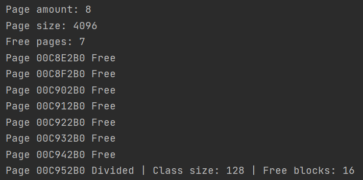
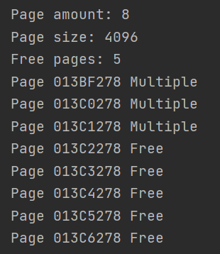
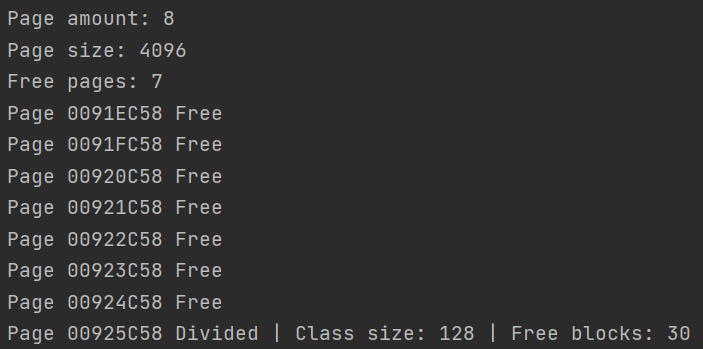
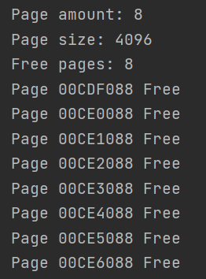
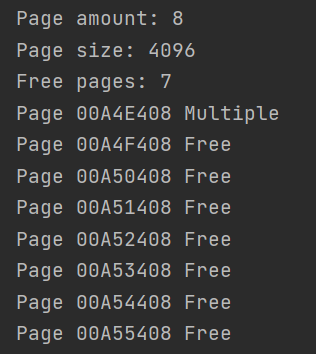

# OS, term 5, Stolynets Dmytro, IP-81
Theme: Page allocator

## Структура
Память, которой оперирует аллокатор, разделена на страницы. Размеры одной страницы может не быть равной размеру виртуальной страницы. 
Размер страниц реализации **4kb**.

Страницы разделены на 2 группы:
- Разбитые на блоки одного размера
- Используемые для выделения памяти на блоки, что размером больше половины страницы

Первая группа разбита на классы. Классы определены размером блока в странице. Минимальный размер блока - 16 байт.
Если блок памяти, которая выделится, является степенью двойки, то размер блока равен следующей степени двойки.

Когда приложение запрашивает к выделению блок памяти больше половины размера страницы, 
выделяется целое количество страниц для выполнения запроса.

Страницы могут быть в одном из трех состояний:
* Free - страница не использована
* Divided - страница разбита на блоки одинакового размера
* MultiplePage - страница используется для выделения памяти под блок больше чем половина размера страницы 

Для отслеживания состояния каждой страницы используются заголовки. Их структура:
* state - состояние страницы
* size - размер блока, на которые разбита страница, или размер блока, на который страница выделена целиком
* startPointer - указатель на последующий свободный блок памяти страницы, если она в состоянии Divided
* blocks - количество свободных блоков, если страница разбита и количество страниц, 
выделенных вместе с текущей при выделении на блок, размером больше половины страницы

Все заголовки хранятся в словаре и к ним можно получить доступ по адресу в памяти. 
Свободные страницы хранятся в отдельном списке. 
Страницы, разделенные в блоки, в которых есть хотя бы 1 свободный блок, хранятся в списке, который можно получить с помощью размера класса.

## Реализация
На старте аллокатор использует стандартный аллокатор С++ для выделениря под своё распоряжение чанка памяти.

`mem_alloc(size_t size)`
> Выделить чанк памяти размером size. Если нельзя выделить требуемое количество памяти - возвращает nullptr.
> Для выделения памяти есть 2 разных случая: когда размер запрашиваемого блока меньше и больше чем половина страницы.
> Когда размер меньше половины страницы:
> 1) Определить класс блока. 
> 2) Найти Divided страницу, в которой есть свободные блоки
> 3) Выделить блок памяти по запросу в даной странице
> 
> Когда размер больше половины страницы:
> 1) Определить количество страниц, которые удовлетворяют потребность в памяти
> 2) Найти нужно количество свободных страниц
> 3) Выделить блок памяти

`mem_free(void* addr)`
> Освобождение блока памяти по адресу addr
> Этот метод также имеет несколько возможных вариантов для типов страниц.
> Для страниц, разделенных на блоки:
> 1) Найти страницу, в которой блок находится
> 2) Освободить блок памяти 
> 3) Переписать startPointer 
> 4) Если страница пуста, переписать её состояние на Free
>
> Для страниц, выделенных под большие блоки памяти:
> 1) Найти первую страницу блока, к которому относиться адрес
> 2) Получить количество страниц, выделенных на блок 
> 3) Освободить страницы
Освобождения памяти мимеет некоторое кличество связанных особенностей, касающихся валидации данных и обьединения блоков для дефрагментации памяти.

`mem_free()`
> освободить всю выделенную память

`mem_realloc(void* addr, size_t size)`
> Перевыделить под блок из адреса addr новый размер блока в size байт.

## Примеры

* Выделение памяти под блоки памяти меньше половины страницы
```
PageAllocator allocator = PageAllocator(32 * 1024);
for (int i = 0; i < 16; ++i)
{
    allocator.mem_alloc(128);
}
```


* Выделение памяти под блоки больше, чем половина страницы
```
PageAllocator allocator = PageAllocator(32 * 1024);

allocator.mem_alloc(4 * 1024);
allocator.mem_alloc(3 * 4 * 1024);
```


* Освобождение блоков меньше чем половина страницы
```
PageAllocator allocator = PageAllocator(32 * 1024);

auto *loc1 = allocator.mem_alloc(128);
allocator.mem_alloc(128);
allocator.mem_alloc(128);
auto *loc3 =  allocator.mem_alloc(128);

allocator.mem_free(loc1);
allocator.mem_free(loc3);
```


* Освобождение всей памяти
```
PageAllocator allocator = PageAllocator(32 * 1024);

allocator.mem_alloc(2 * 4 * 1024);
for (int i = 0; i < 4; ++i)
{
    allocator.mem_alloc(1024);
}

allocator.mem_free();
```


* Перевыделение памяти
```
PageAllocator allocator = PageAllocator(32 * 1024);

auto *loc = allocator.mem_alloc(512);
loc = allocator.mem_realloc(loc, 4 * 1024);
```

